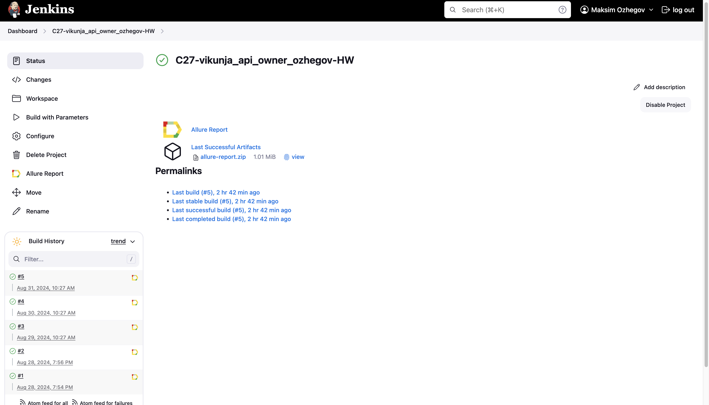
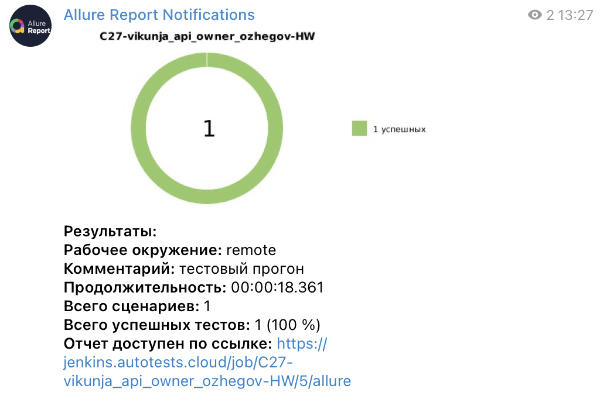

# Автоматизация тестирования c использованием библиотеки Owner

## <a>**Задача:**</a>

1. Разработать автотесты с использованием UI + API
2. С помощью бибилиотеки [Owner](https://matteobaccan.github.io/owner/):
    1. Сделать конфигурацию для WEB тестов:
       - Имя браузера
       - Версия браузера
       - Локальный или удаленный
    2. Сделать два вида конфигурационных файлов:
       - Для локального запуска на Сhrome
       - Для удаленного запуска на Selenoid
    3. Сделать возможность с помощью одной системной переменной переключать запуск с локального на удаленный.
  
## <a>**Реализация:**</a>
1. Разработан автотест на корректность добавления новой задачи в приложении [Vikunja](https://try.vikunja.io/)
    1. Регистрация и авторизация с помощью API запросов с использованием **REST Assured**
       - Авторизацию с аннотацией **@WithLogin**
       - Использованы **Lombok** модели
       - Сформированы спецификации ответов и запросов
    2. Осуществление проверок через UI с использованием **Selenide** + **JUnit5**

2. Настроена конфигурация проекта с помощью бибилиотеки **Owner**

- Команда для запуска тестов локально:
```shell
gradle clean test -Denv=local
```
- Команда для запуска тестов на Selenoid:
```shell
gradle clean test -Denv=remote
```
4. Настроен запуск тестов в **Jenkins**

## </a><a name="Сборка в Jenkins"></a>Сборка в [Jenkins](https://jenkins.autotests.cloud/job/C27-vikunja_api_owner_ozhegov-HW)</a>

<p align="center">  
  
</p>

4. Подключен **Allure Report**:
- Прописаны шаги тестов (step)
- Использованы кастомизированные логи
- Добавлены скриншоты, логи и видео после выполнения каждого теста

## </a><a name="Интеграция с Allure Report"></a>Интеграция с [Allure Report](https://jenkins.autotests.cloud/job/C27-vikunja_api_owner_ozhegov-HW/allure/)</a>

<p align="center">  
  
</p>

5. Добавить уведомления о результатах прохождении автотестов с помощью **Telegram-бота**

## </a><a name="Уведомления в Telegram при помощи бота"></a>Уведомления в Telegram при помощи бота</a>
<p align="center">  
  
</p>
